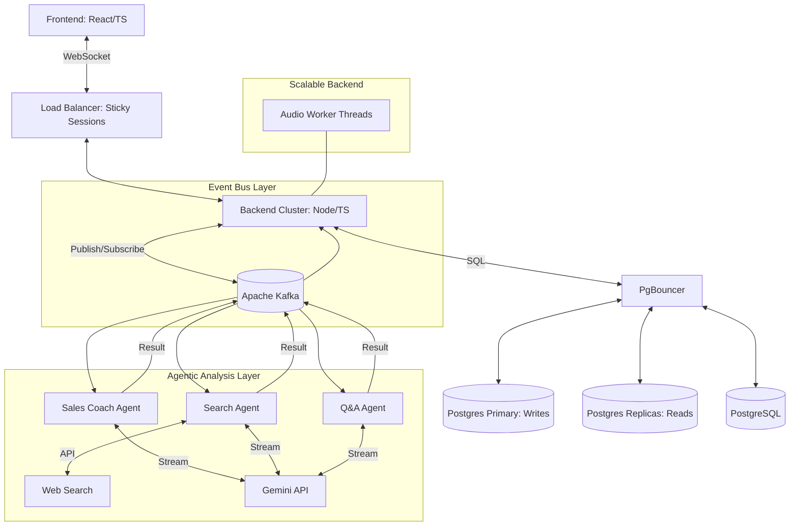

# Detailed Specification: Wingman (Real-Time Sales Assistant)

## 1. Project Overview
"Wingman" is a real-time assistant designed to help sales professionals during live calls. It captures audio, provides live transcription, and generates actionable insights and recommendations in real-time.

## 2. Technology Stack
- **Frontend**: TypeScript, React.js (Vite), Tailwind CSS, Lucide-React.
- **Backend**: TypeScript, Node.js, Express.js (REST), Socket.io (Real-time).
- **Infrastructure**: 
    - **Message Bus**: **Apache Kafka** (High-throughput event streaming for 1000+ users).
    - **Caching/State**: Redis Cluster.
    - **Database**: PostgreSQL with **Read Replicas** and **Multitenant Sharding**.
    - **Speech-to-Text (STT)**: Deepgram (Low-latency WebSocket streaming).
    - **Agent Orchestrator**: Node.js custom logic (Parallel execution).
    - **LLM**: Gemini 1.5 Flash (Core reasoning & synthesis).
    - **Search**: Tavily API or Google Search API (Real-time web retrieval).

## 3. High-Level Architecture

## 4. Functional Requirements
### 4.1 Frontend Features
- **Dashboard**: Overview of recent calls and statistics.
- **Live Call Interface**:
    - **Audio Streaming**: Uses `MediaRecorder` API to send float32 PCM chunks to the backend.
    - **Visual Waveform**: Real-time visualization of audio input.
    - **Streaming Transcript**: Displays the conversation as it happens, with speaker diarization if possible.
    - **Live Insights**: Toast-like notifications or a sidebar with AI-generated tips (e.g., "Customer mentioned a pain point: Budget").
    - **Feedback Loop**: "Like" or "Dislike" buttons on each recommendation to improve the model.
- **Call History**: Searchable database of past calls with summaries and key moments.

### 4.2 Backend Features
- **Streaming Orchestrator**: Manages data flow between client, STT, and the Agentic Layer.
- **Agentic Analysis Layer**:
    - **Sales Coach Agent**: Analyzes transcript chunks for tone, objection handling, and closing opportunities.
    - **Web Search Agent**: Triggered by mentions of competitors, news, or specific products to surface external context.
    - **Q&A Agent**: Monitors the transcript for explicit or implicit questions and prepares concise, factual answers.
- **Buffering Logic**: Aggregates transcript fragments into semantic blocks to provide sufficient context for agents.
- **Persistence**: Stores both user-facing insights and background agent reasoning for later review.

## 5. Data Model (PostgreSQL)

### `User`
- `id`: UUID (PK)
- `email`: String (Unique)
- `name`: String
- `created_at`: Datetime

### `CallSession`
- `id`: UUID (PK)
- `user_id`: UUID (FK)
- `title`: String
- `start_time`: Datetime
- `end_time`: Datetime
- `full_transcript`: Text
- `summary`: Text

### `Recommendation`
- `id`: UUID (PK)
- `call_session_id`: UUID (FK)
- `content`: Text
- `category`: String (e.g., "Objection Handling", "Closing", "Knowledge Base")
- `context_snippet`: Text (The part of the transcript that triggered this)
- `feedback_status`: Enum (NONE, LIKED, DISLIKED)
- `created_at`: Datetime

## 6. Real-Time Communication Protocol (Socket.io)

| Event Name | Direction | Payload | Description |
|---|---|---|---|
| `start-call` | Client -> Server | `{ title: string }` | Initializes a new session |
| `audio-chunk` | Client -> Server | `Buffer` | Raw audio data chunks |
| `transcript` | Server -> Client | `{ text: string, isFinal: bool }` | Real-time transcription updates |
| `insight` | Server -> Client | `{ id: uuid, content: string }` | AI-generated recommendation |
| `feedback` | Client -> Server | `{ id: uuid, status: 'liked' }` | User feedback on insight |
| `end-call` | Client -> Server | - | Finalizes and saves the session |

## 7. Performance Considerations
- **Latency**: Aim for < 2 seconds from audio input to recommendation display.
- **Concurrency**: Use horizontal scaling with a Redis adapter for Socket.io. Ensure the Node.js main thread remains non-blocking by offloading audio buffering and parsing to worker threads.
- **Database Indexing**: Index `CallSession.user_id` and `Recommendation.call_session_id`.
- **Connection Management**: Use PgBouncer to manage high-volume connections from clustered backend instances to PostgreSQL.

## 8. Scalability & Tradeoffs

The architecture has been evolved to support 100+ simultaneous users. Below are the key changes and their tradeoffs:

| Change | Reason | Tradeoff |
|---|---|---|
| **Redis Adapter** | Enables horizontal scaling; allows multiple backend instances to share socket events. | Increases infrastructure complexity and introduces a dependency on Redis. |
| **Worker Threads** | Prevents Node.js event loop saturation from heavy binary audio processing. | Complex state management between the main thread and workers. |
| **PgBouncer** | Efficiently manages database connection limits when scaling backend nodes. | Another layer in the stack; adds slight overhead to query latency (minimal). |
| **Sticky Sessions** | Required for WebSockets to ensure clients stay connected to the same server node. | Can lead to uneven load distribution if sessions are very long-lived. |
| **Gemini 1.5 Flash** | Lower latency and higher rate limits compared to larger models. | Slightly lower reasoning capability, though sufficient for sales triggers. |
| **Multi-Agent Orchestration** | Provides specialized, high-quality insights (Search, Q&A, Coaching) simultaneously. | **Latency**: Waiting for search results can delay insights. **Cost**: Higher token usage due to multiple parallel LLM calls. |
| **Apache Kafka** | Replaces Redis Pub/Sub at 1000+ users to handle massive event throughput and provide persistence. | Significantly higher operational complexity than Redis. |
| **Database Sharding** | Distributes write load across multiple DB instances to prevent IO saturation. | Complex migrations and cross-shard querying challenges. |

## 9. Future Roadmap
- Integration with CRMs (Salesforce, HubSpot).
- Real-time sentiment analysis visualization.
- Multi-speaker identification (Diarization).
- Custom Playbooks: Allow managers to define specific triggers and recommendations.
