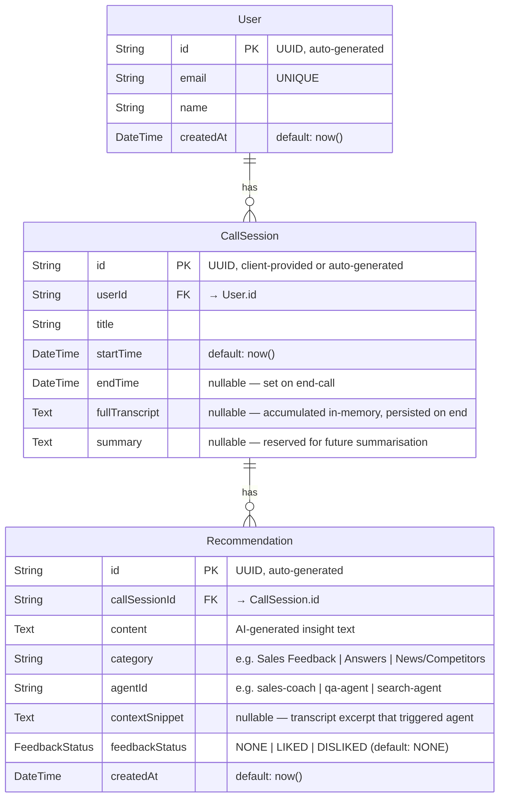

# Wingman — Database Design

**Engine:** PostgreSQL  
**ORM:** Prisma v6 (`engineType = "library"`)  
**Schema file:** `prisma/schema.prisma`

---

## 1. Entity-Relationship Diagram



---

## 2. Tables

### 2.1 `User`

Represents a Wingman user. Currently only a single admin user (`admin@wingman.local`) is seeded and used by all sessions.

| Column | Type | Constraints | Notes |
|---|---|---|---|
| `id` | `TEXT` | PK, `DEFAULT uuid_generate_v4()` | UUID v4 |
| `email` | `TEXT` | NOT NULL, UNIQUE | Login identifier |
| `name` | `TEXT` | NOT NULL | Display name |
| `createdAt` | `TIMESTAMP` | NOT NULL, `DEFAULT now()` | Record creation time |

**Indexes:**
- `PRIMARY KEY (id)`
- `UNIQUE INDEX ON email`

**Seeded record:**

| email | name |
|---|---|
| `admin@wingman.local` | `Admin` |

---

### 2.2 `CallSession`

A single live or simulated sales call. Created when a client emits `start-call` and closed when `end-call` is received.

| Column | Type | Constraints | Notes |
|---|---|---|---|
| `id` | `TEXT` | PK | UUID v4 — supplied by the client frontend |
| `userId` | `TEXT` | NOT NULL, FK → `User.id` | Always the seeded admin user |
| `title` | `TEXT` | NOT NULL | Provided by the client on `start-call` |
| `startTime` | `TIMESTAMP` | NOT NULL, `DEFAULT now()` | Set at session creation |
| `endTime` | `TIMESTAMP` | NULLABLE | Set when `end-call` is processed |
| `fullTranscript` | `TEXT` | NULLABLE | Accumulated transcript — persisted atomically on session end |
| `summary` | `TEXT` | NULLABLE | Reserved for future AI-generated session summary |

**Indexes:**
- `PRIMARY KEY (id)`
- `INDEX ON (userId)` — fast lookup of all sessions for a user
- `INDEX ON (startTime DESC)` — dashboard chronological sorting

**Lifecycle:**

```
INSERT (startTime = now, endTime = NULL)
   │
   │  ← audio chunks streamed in real-time, transcript held in memory
   │
UPDATE (endTime = now, fullTranscript = <accumulated text>)
```

---

### 2.3 `Recommendation`

An AI-generated insight produced by one of the three agents during a call. Currently broadcast to the frontend in real-time but **not yet auto-persisted** (see [Known Gap](#4-known-gaps)).

| Column | Type | Constraints | Notes |
|---|---|---|---|
| `id` | `TEXT` | PK, `DEFAULT uuid_generate_v4()` | UUID v4 |
| `callSessionId` | `TEXT` | NOT NULL, FK → `CallSession.id` | Parent session |
| `content` | `TEXT` | NOT NULL | Full insight text from the agent |
| `category` | `TEXT` | NOT NULL | High-level bucket — see values below |
| `agentId` | `TEXT` | NOT NULL | Which agent produced it — see values below |
| `contextSnippet` | `TEXT` | NULLABLE | The transcript fragment that triggered this agent |
| `feedbackStatus` | `ENUM` | NOT NULL, `DEFAULT 'NONE'` | `NONE` \| `LIKED` \| `DISLIKED` |
| `createdAt` | `TIMESTAMP` | NOT NULL, `DEFAULT now()` | Insight generation time |

**Indexes:**
- `PRIMARY KEY (id)`
- `INDEX ON (callSessionId)` — fetch all insights for a session
- `INDEX ON (category)` — filter by agent type
- `INDEX ON (createdAt DESC)` — chronological insight retrieval

**`category` values:**

| Value | Agent |
|---|---|
| `Sales Feedback` | Sales Coach |
| `Answers` | Q&A Agent |
| `News/Competitors` | Search Agent |

**`agentId` values:**

| Value | Description |
|---|---|
| `sales-coach` | Sales coaching recommendations |
| `qa-agent` | Factual question answers |
| `search-agent` | Web-search-backed competitor/news summaries |

---

### 2.4 `FeedbackStatus` Enum

```sql
CREATE TYPE "FeedbackStatus" AS ENUM ('NONE', 'LIKED', 'DISLIKED');
```

| Value | Meaning |
|---|---|
| `NONE` | Default — user has not rated this insight |
| `LIKED` | User clicked 👍 |
| `DISLIKED` | User clicked 👎 |

---

## 3. Repository Access Patterns

### `UserRepository`

| Method | Query | Usage |
|---|---|---|
| `findById(id)` | `SELECT * WHERE id = ?` | Look up user by PK |
| `findByEmail(email)` | `SELECT * WHERE email = ?` | Check if user exists |
| `upsertByEmail(email, name)` | `INSERT … ON CONFLICT UPDATE` | Ensure admin user exists at session start |

### `CallSessionRepository`

| Method | Query | Usage |
|---|---|---|
| `create(userId, title, id?)` | `INSERT INTO CallSession` | Called on `start-call` |
| `findById(id)` | `SELECT … INCLUDE recommendations WHERE id = ?` | Session detail with insights |
| `findByUserId(userId)` | `SELECT … WHERE userId = ? ORDER BY startTime DESC` | Dashboard session list |
| `endSession(id, transcript, summary?)` | `UPDATE SET endTime, fullTranscript, summary WHERE id = ?` | Called on `end-call` |
| `appendTranscript(id, text)` | `SELECT … UPDATE` (two queries) | Incremental transcript append ⚠️ |

> **⚠️ Note on `appendTranscript`:** This method performs a read-then-write that is not atomic. It is not currently called in the hot path (the backend accumulates transcript in memory and writes once on session end), but if it were used concurrently it could suffer a lost-update race condition. A future fix should use a single `UPDATE … SET fullTranscript = fullTranscript || ' ' || $1`.

### `RecommendationRepository`

| Method | Query | Usage |
|---|---|---|
| `create(data)` | `INSERT INTO Recommendation` | Persist an agent insight |
| `updateFeedback(id, status)` | `UPDATE SET feedbackStatus WHERE id = ?` | Called on `feedback` event |
| `findBySessionId(callSessionId)` | `SELECT … WHERE callSessionId = ? ORDER BY createdAt DESC` | Fetch all insights for a session |

---

## 4. Known Gaps

| Gap | Description | Location |
|---|---|---|
| **Insight auto-persistence** | Agent insights are broadcast over Socket.io in real-time but `Recommendation` records are never written. `callSessionService.saveInsight()` exists but is not wired to the `result-aggregators` consumer. | `src/server.ts` → `startInsightListener` callback |
| **Non-atomic transcript append** | `appendTranscript` reads then writes in two DB round-trips; safe only because it isn't used in the live audio path (transcript is held in memory). | `src/repositories/CallSessionRepository.ts:36` |
| **Single admin user** | All sessions are owned by the seeded `admin@wingman.local` user. Multi-user support would require auth and per-user session isolation. | `src/services/callSessionService.ts:17` |

---

## 5. Migration & Seed

```bash
# Run migrations (creates all tables, indexes, enums)
npm run prisma:migrate

# Generate the Prisma client after schema changes
npm run prisma:generate

# Seed: creates the default admin user
npm run db:setup

# Inspect data interactively
npm run prisma:studio
```

The seed script (`prisma/seed.ts` or equivalent) calls `UserRepository.upsertByEmail('admin@wingman.local', 'Admin')` — safe to run multiple times.
