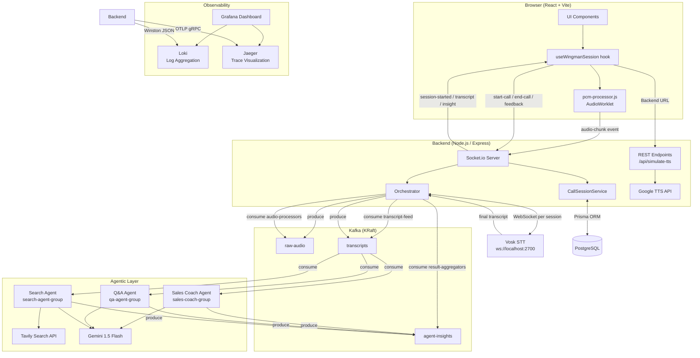
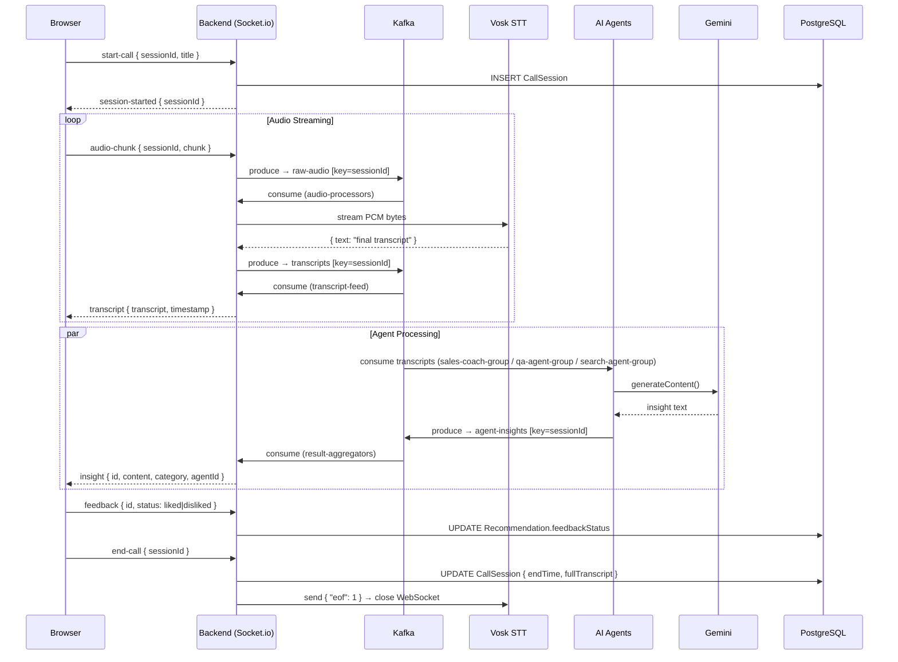
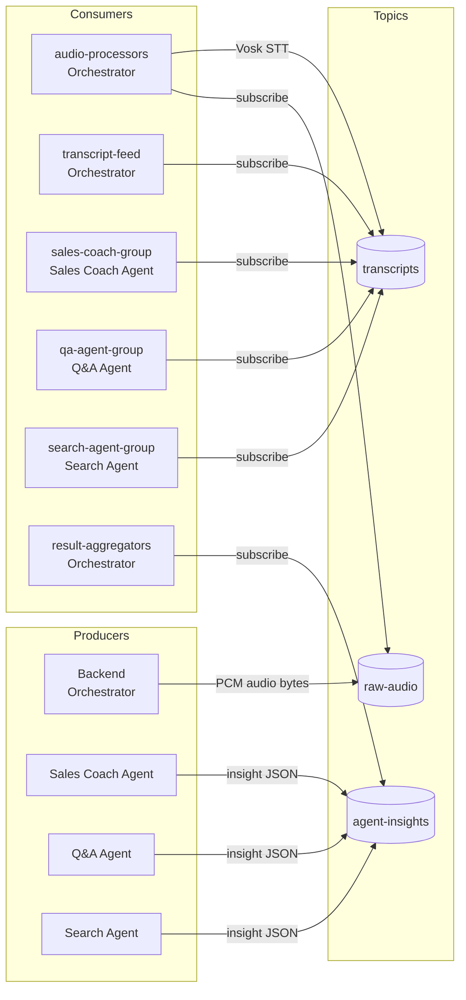
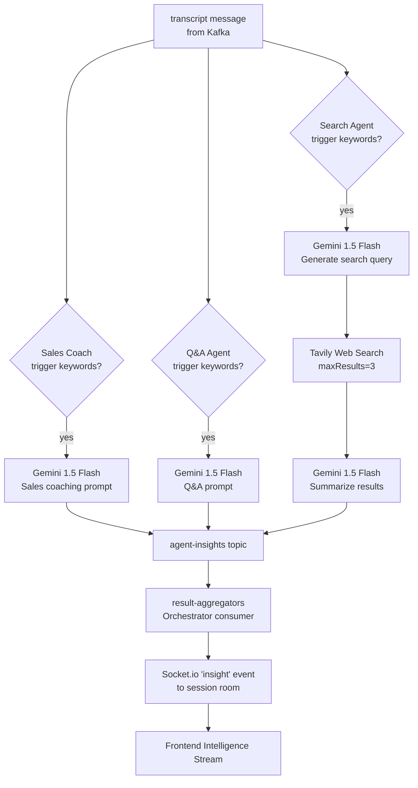
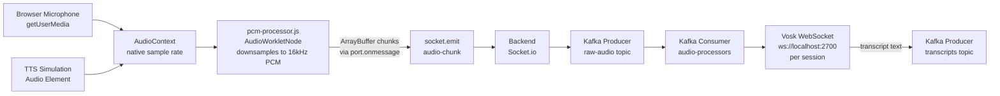
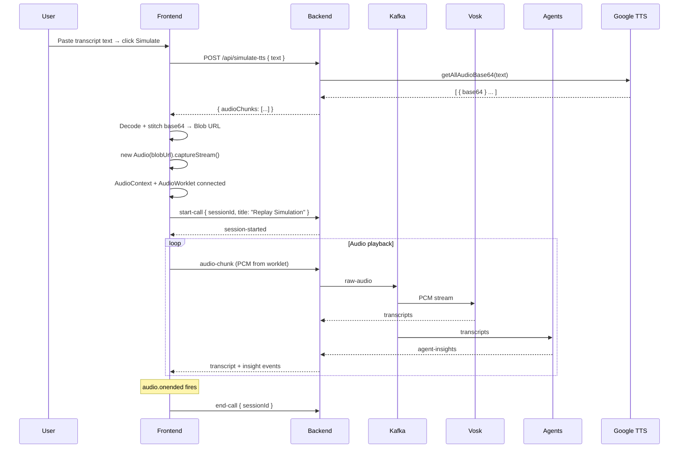
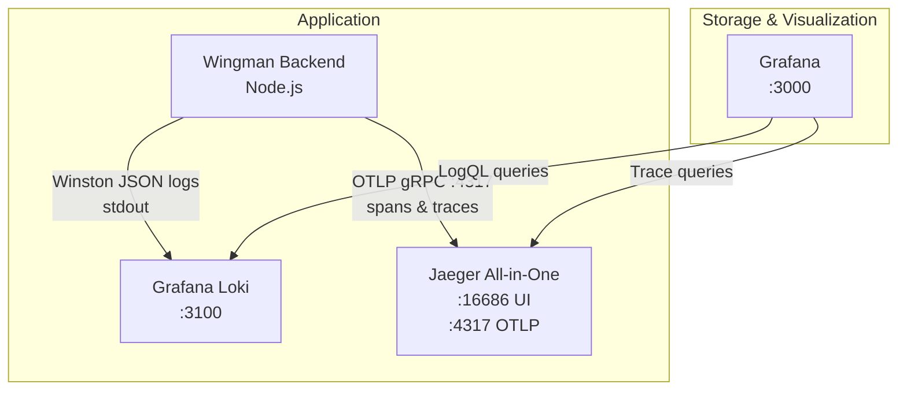
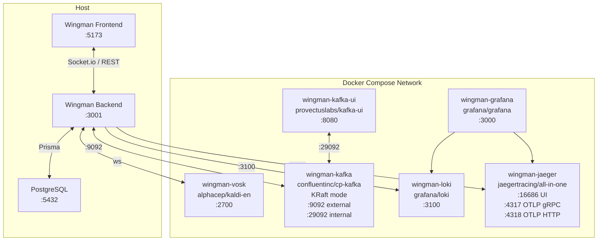

# Wingman — System Architecture

## 1. High-Level Component Overview

---

## 2. Real-Time Data Flow (Sequence)

---

## 3. Kafka Topics & Consumer Groups

| Topic | Key | Value | Produced By | Consumed By |
|---|---|---|---|---|
| `raw-audio` | `sessionId` | Raw PCM `Buffer` | Orchestrator | `audio-processors` (Orchestrator) |
| `transcripts` | `sessionId` | `{ transcript, timestamp }` JSON | Orchestrator (via Vosk) | `transcript-feed`, `sales-coach-group`, `qa-agent-group`, `search-agent-group` |
| `agent-insights` | `sessionId` | `{ agentId, category, content }` JSON | All three agents | `result-aggregators` (Orchestrator) |

---

## 4. Agentic Analysis Pipeline

### Agent Trigger Keywords

| Agent | Group ID | Trigger Keywords |
|---|---|---|
| Sales Coach | `sales-coach-group` | `budget`, `price`, `competitor`, `interest`, `no`, `yes`, `how much` |
| Q&A Agent | `qa-agent-group` | `how do I`, `what is`, `can we`, `does it`, `why`, `difference` |
| Search Agent | `search-agent-group` | `competitor`, `news`, `industry trend`, `pricing`, `feature compare` |

---

## 5. Audio Pipeline Detail

---

## 6. Simulator Panel Flow

---

## 7. Observability Stack

### Instrumented Spans

| Span Name | Trigger | Attributes |
|---|---|---|
| `socket.start-call` | `start-call` socket event | `call.title`, `call.session_id` |
| `socket.feedback` | `feedback` socket event | `feedback.id`, `feedback.status` |
| `socket.end-call` | `end-call` socket event | `call.session_id` |

Auto-instrumented via OpenTelemetry SDK: HTTP, Express routes, KafkaJS producers/consumers.

Each log entry is automatically enriched with `traceId` and `spanId` from the active OTel context, enabling log-to-trace correlation in Grafana.

---

## 8. Infrastructure (Docker Compose)

