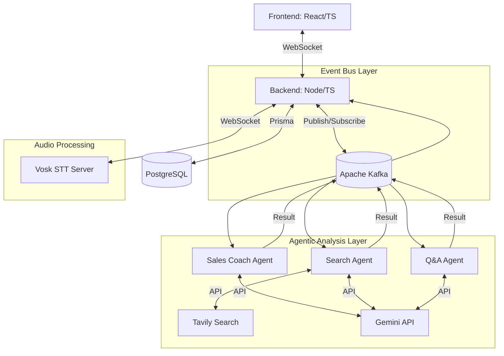

# Detailed Specification: Wingman (Real-Time Sales Assistant)

## 1. Project Overview
"Wingman" is a real-time assistant designed to help sales professionals during live calls. It captures audio, provides live transcription, and generates actionable insights and recommendations in real-time.

## 2. Technology Stack
- **Frontend**: TypeScript, React.js (Vite), Tailwind CSS, Lucide-React, Socket.io-client.
- **Backend**: TypeScript, Node.js, Express.js (REST), Socket.io (Real-time), KafkaJS.
- **Infrastructure**:
    - **Message Bus**: **Apache Kafka** (High-throughput event streaming).
    - **Database**: PostgreSQL with **Prisma ORM**.
    - **Speech-to-Text (STT)**: Vosk (Self-hosted via Docker, low-latency WebSocket streaming).
    - **Agent Orchestrator**: Kafka-based decoupled consumers (Consumer Groups for horizontal scaling).
    - **LLM**: Gemini 1.5 Flash (Core reasoning & synthesis).
    - **Search**: Tavily API (Real-time web retrieval).
    - **TTS Simulation**: Google TTS API.

## 3. High-Level Architecture

## 4. Functional Requirements
### 4.1 Frontend Features
- **Dashboard**: Overview of recent calls and statistics.
- **Live Call Interface**:
    - **Audio Streaming**: Uses `MediaRecorder` API to send audio chunks to the backend via Socket.io.
    - **Visual Waveform**: Real-time visualization of audio input.
    - **Intelligence Stream**: Displays real-time recommendations and insights from various agents.
    - **Simulator Panel**: Allows users to simulate a call by providing text which is converted to audio and processed by the system.
    - **Feedback Loop**: "Like" or "Dislike" buttons on each recommendation to improve the model.
- **Call History**: Searchable database of past calls with summaries and key moments.

### 4.2 Backend Features
- **Kafka Orchestrator**: Manages topics (`raw-audio`, `transcripts`, `agent-insights`) and routes data between services.
- **Audio Processor**: Consumes `raw-audio` from Kafka and streams it to Vosk STT via WebSockets.
- **Agentic Analysis Layer**:
    - **Sales Coach Agent**: Analyzes transcripts for tone and objection handling based on predefined prompts.
    - **Search Agent**: A 3-step process: (1) Generate search query with LLM, (2) Search with Tavily, (3) Summarize results with LLM.
    - **Q&A Agent**: Provides answers to questions detected in the transcript.
- **Persistence**: Stores users, call sessions, and recommendations in PostgreSQL using Prisma.

## 5. Data Model (Prisma/PostgreSQL)

### `User`
- `id`: String (PK, UUID)
- `email`: String (Unique)
- `name`: String
- `createdAt`: DateTime

### `CallSession`
- `id`: String (PK, UUID)
- `userId`: String (FK)
- `title`: String
- `startTime`: DateTime
- `endTime`: DateTime?
- `fullTranscript`: Text?
- `summary`: Text?

### `Recommendation`
- `id`: String (PK, UUID)
- `callSessionId`: String (FK)
- `content`: Text
- `category`: String (e.g., "Sales Feedback", "Answers", "News/Competitors")
- `agentId`: String (e.g., "sales-coach", "qa-agent", "search-agent")
- `contextSnippet`: Text?
- `feedbackStatus`: Enum (NONE, LIKED, DISLIKED)
- `createdAt`: DateTime

## 6. Real-Time Communication Protocol (Socket.io)

| Event Name | Direction | Payload | Description |
|---|---|---|---|
| `start-call` | Client -> Server | `{ sessionId?: string, title: string }` | Initializes a new session |
| `session-started`| Server -> Client | `{ sessionId: string, title: string }` | Confirms session creation |
| `audio-chunk` | Client -> Server | `{ sessionId: string, chunk: Buffer }` | Raw audio data chunks |
| `insight` | Server -> Client | `{ id: uuid, content: string, category: string, agentId: string }` | AI-generated recommendation |
| `feedback` | Client -> Server | `{ sessionId: string, id: string, status: 'liked' }` | User feedback on insight |
| `end-call` | Client -> Server | `{ sessionId: string }` | Finalizes and saves the session |

*Note: Transcription is currently internal to the backend orchestration and not streamed back to the client in the current implementation.*

## 7. Performance & Scalability
- **Kafka Consumer Groups**: Agents (Sales Coach, Search, Q&A) are organized into separate Kafka consumer groups (`sales-coach-group`, `search-agent-group`, `qa-agent-group`), allowing for independent horizontal scaling.
- **Vosk**: Self-hosted STT allows for low-latency processing without external API overhead for the transcription itself.
- **Gemini 1.5 Flash**: Optimized for speed and cost while providing sufficient reasoning for real-time triggers.

## 8. Future Roadmap
- Streaming transcripts to the frontend for real-time visual feedback.
- Integration with CRMs (Salesforce, HubSpot).
- Real-time sentiment analysis.
- Multi-speaker identification (Diarization).
- Custom Playbooks for specific sales methodologies.
