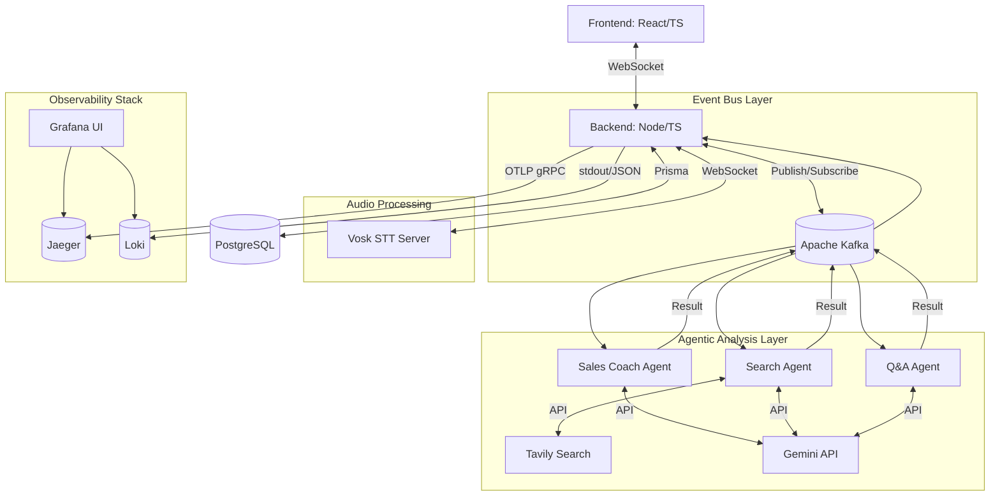

# Detailed Specification: Wingman (Real-Time Sales Assistant)

## 1. Project Overview
"Wingman" is a real-time assistant designed to help sales professionals during live calls. It captures audio, provides live transcription, and generates actionable insights and recommendations in real-time.

## 2. Technology Stack
- **Frontend**: TypeScript, React.js (Vite), Tailwind CSS, Lucide-React, Socket.io-client.
- **Backend**: TypeScript, Node.js, Express.js (REST), Socket.io (Real-time), KafkaJS.
- **Infrastructure**:
    - **Message Bus**: **Apache Kafka** (KRaft mode, no Zookeeper).
    - **Database**: PostgreSQL with **Prisma ORM** (v6.x, `engineType = "library"`).
    - **Speech-to-Text (STT)**: Vosk (Self-hosted via Docker, low-latency WebSocket streaming).
    - **Agent Orchestrator**: Kafka-based decoupled consumers (Consumer Groups for horizontal scaling).
    - **LLM**: Gemini 1.5 Flash (Core reasoning & synthesis).
    - **Search**: Tavily API (Real-time web retrieval).
    - **TTS Simulation**: Google TTS API.
- **Observability**:
    - **Structured Logging**: Winston (JSON in production, colorized in dev, with auto-trace correlation).
    - **Distributed Tracing**: OpenTelemetry SDK (`@opentelemetry/sdk-node`) with OTLP/gRPC exporter to Jaeger.
    - **Log Aggregation**: Grafana Loki (local, Docker-hosted).
    - **Trace Visualization**: Jaeger All-in-One (local, Docker-hosted, in-memory store).
    - **Unified Dashboard**: Grafana (single UI for both logs and traces).

## 3. High-Level Architecture

```mermaid
graph TD
    Client[Frontend: React/TS] <-->|WebSocket| Backend[Backend: Node/TS]

    subgraph "Event Bus Layer"
    Backend <-->|Publish/Subscribe| Kafka[(Apache Kafka)]
    end

    subgraph "Agentic Analysis Layer"
    Kafka --> Agent1[Sales Coach Agent]
    Kafka --> Agent2[Search Agent]
    Kafka --> Agent3[Q&A Agent]
    Agent2 <-->|API| SearchAPI[Tavily Search]
    Agent1 & Agent2 & Agent3 <-->|API| LLM[Gemini API]
    end

    Agent1 & Agent2 & Agent3 -->|Result| Kafka
    Kafka --> Backend

    Backend <-->|Prisma| DB[(PostgreSQL)]

    subgraph "Audio Processing"
    Backend <-->|WebSocket| Vosk[Vosk STT Server]
    end

    subgraph "Observability Stack"
    Backend -->|OTLP gRPC| Jaeger[(Jaeger)]
    Backend -->|stdout/JSON| Loki[(Loki)]
    Grafana[Grafana UI] --> Jaeger
    Grafana --> Loki
    end
```

## 4. Functional Requirements

### 4.1 Frontend Features
- **Live Call Interface**:
    - **Audio Streaming**: Uses `MediaRecorder` API to send audio chunks to the backend via Socket.io.
    - **Visual Waveform**: Real-time visualization of audio input.
    - **Live Transcript**: Transcribed speech is streamed back to the frontend in real-time via the `transcript` Socket.io event.
    - **Intelligence Stream**: Displays real-time recommendations and insights from various agents.
    - **Simulator Panel (Practice Mode)**: Users can paste any transcript text to replay a call through the full AI pipeline (text → TTS → audio pipeline). Helper description guides users to copy transcripts from the conversation view.
    - **Feedback Loop**: "Like" or "Dislike" buttons on each recommendation.

### 4.2 Backend Features
- **Kafka Orchestrator** (`kafkaOrchestrator.ts`): Manages topics (`raw-audio`, `transcripts`, `agent-insights`) and routes data between services. Maintains three consumer groups:
    - `audio-processors`: Streams raw audio to Vosk STT.
    - `result-aggregators`: Forwards agent insights to the Socket.io layer.
    - `transcript-feed`: Streams processed transcripts back to the connected client in real-time.
- **Audio Processor**: Consumes `raw-audio` from Kafka and streams it to Vosk STT via WebSockets per session. Manages per-session WebSocket lifecycle.
- **Agentic Analysis Layer**:
    - **Sales Coach Agent**: Analyzes transcripts for tone and objection handling.
    - **Search Agent**: 3-step pipeline: (1) Generate search query with LLM, (2) Search with Tavily, (3) Summarize with LLM.
    - **Q&A Agent**: Provides answers to questions detected in the transcript.
- **Persistence** (`callSessionService.ts`, `callSessionRepository.ts`):
    - All call sessions are associated with a default `admin` user (seeded on startup).
    - `startSession()` creates a `CallSession` record.
    - `endSession()` closes the session and persists the full transcript.
    - `recordFeedback()` updates the `feedbackStatus` on a `Recommendation`.
- **Observability**:
    - Centralized logger (`src/utils/logger.ts`) auto-enriches log entries with `traceId` and `spanId` from the active OpenTelemetry context.
    - OpenTelemetry is initialized at application startup (`src/config/tracing.ts`) before any other library imports, ensuring HTTP, Express, and Kafka are auto-instrumented.
    - Manual OpenTelemetry spans wrap key Socket.io events: `socket.start-call`, `socket.end-call`, `socket.feedback`.

## 5. Data Model (Prisma/PostgreSQL)

### `User`
| Field | Type | Notes |
|---|---|---|
| `id` | String | PK, UUID |
| `email` | String | Unique |
| `name` | String | |
| `createdAt` | DateTime | |

### `CallSession`
| Field | Type | Notes |
|---|---|---|
| `id` | String | PK, UUID |
| `userId` | String | FK → User |
| `title` | String | |
| `startTime` | DateTime | |
| `endTime` | DateTime? | Set on `end-call` |
| `fullTranscript` | Text? | Persisted on session end |
| `summary` | Text? | |

### `Recommendation`
| Field | Type | Notes |
|---|---|---|
| `id` | String | PK, UUID |
| `callSessionId` | String | FK → CallSession |
| `content` | Text | |
| `category` | String | e.g., "Sales Feedback", "Answers", "News/Competitors" |
| `agentId` | String | e.g., "sales-coach", "qa-agent", "search-agent" |
| `contextSnippet` | Text? | |
| `feedbackStatus` | Enum | `NONE` \| `LIKED` \| `DISLIKED` |
| `createdAt` | DateTime | |

## 6. Real-Time Communication Protocol (Socket.io)

| Event Name | Direction | Payload | Description |
|---|---|---|---|
| `start-call` | Client → Server | `{ sessionId?: string, title: string }` | Initializes a new DB-backed session |
| `session-started` | Server → Client | `{ sessionId: string, title: string }` | Confirms session creation with DB ID |
| `audio-chunk` | Client → Server | `{ sessionId: string, chunk: Buffer }` | Raw audio data chunks |
| `transcript` | Server → Client | `{ transcript: string, timestamp: number }` | Live transcribed text pushed to client |
| `insight` | Server → Client | `{ id: uuid, content: string, category: string, agentId: string }` | AI-generated recommendation |
| `feedback` | Client → Server | `{ sessionId: string, id: string, status: 'liked' \| 'disliked' }` | User feedback on an insight |
| `end-call` | Client → Server | `{ sessionId: string }` | Finalizes and persists the session |

## 7. Infrastructure & Local Services (Docker Compose)

| Service | Image | Port(s) | Purpose |
|---|---|---|---|
| `wingman-vosk` | `alphacep/kaldi-en` | 2700 | Local STT engine |
| `wingman-kafka` | `confluentinc/cp-kafka` (KRaft) | 9092, 29092, 9093 | Message bus |
| `wingman-kafka-ui` | `provectuslabs/kafka-ui` | 8080 | Kafka topic inspector |
| `wingman-loki` | `grafana/loki` | 3100 | Structured log storage |
| `wingman-jaeger` | `jaegertracing/all-in-one` | 16686 (UI), 4317 (OTLP gRPC), 4318 (OTLP HTTP) | Trace storage & visualization |
| `wingman-grafana` | `grafana/grafana` | 3000 | Unified observability dashboard |

## 8. Performance & Scalability
- **Kafka Consumer Groups**: All three agents use separate consumer groups, allowing independent horizontal scaling.
- **Vosk**: Self-hosted STT provides low-latency transcription with WebSocket streaming per session.
- **Gemini 1.5 Flash**: Optimized for speed and cost for real-time triggers.
- **Prisma Singleton**: A single `PrismaClient` instance is shared across the application to prevent connection exhaustion.

## 9. Future Roadmap
- Integration with CRMs (Salesforce, HubSpot).
- Real-time sentiment analysis.
- Multi-speaker identification (Diarization).
- Custom Playbooks for specific sales methodologies.
- Grafana dashboard with pre-configured Loki and Jaeger data sources.
